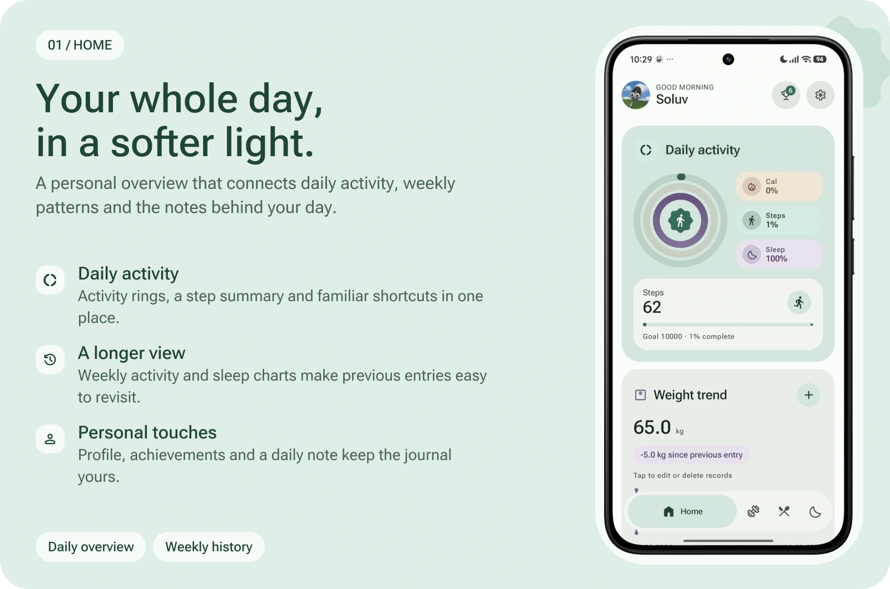
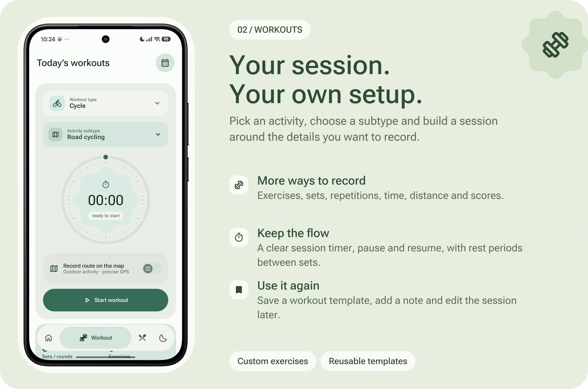
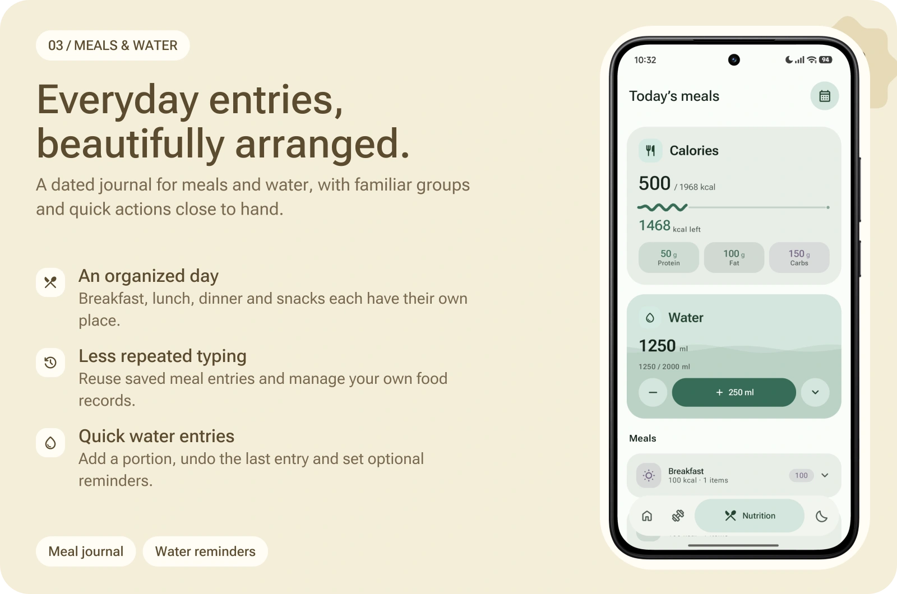
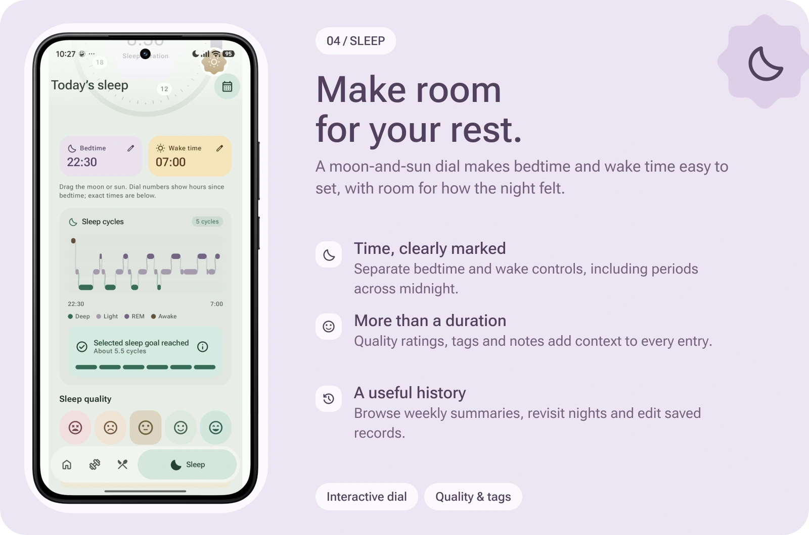
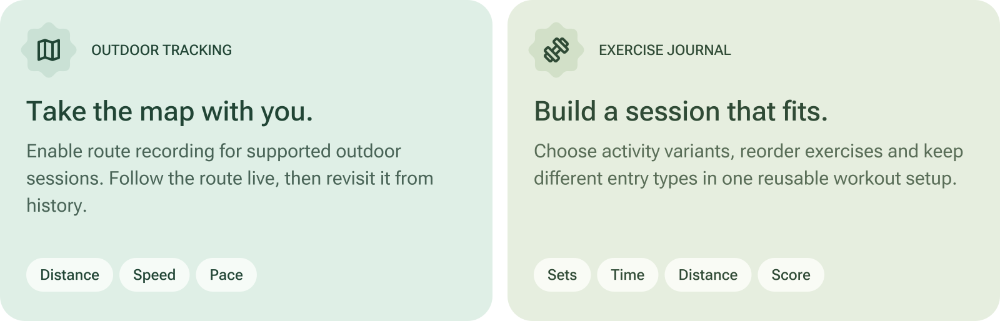
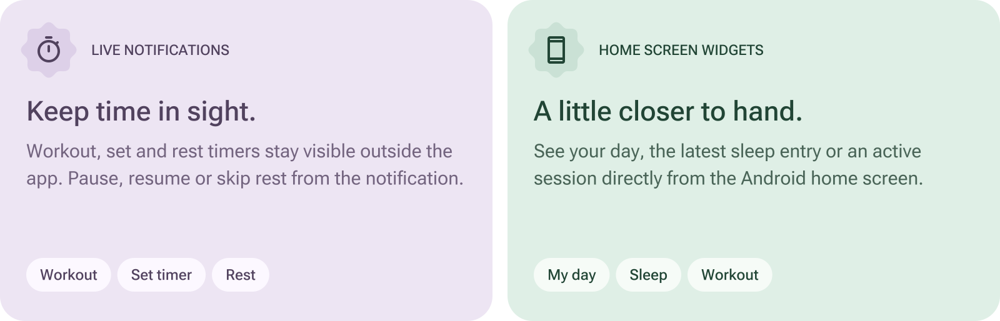
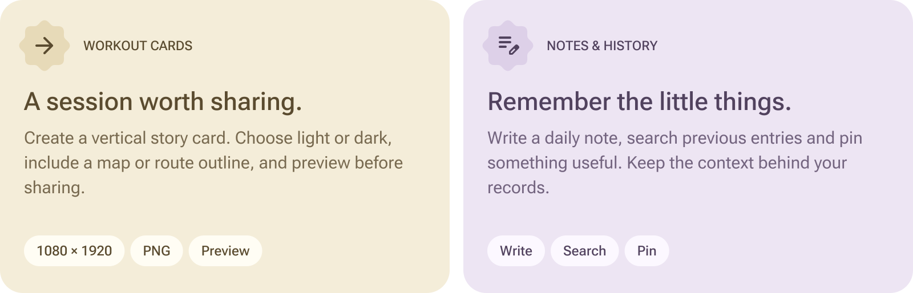
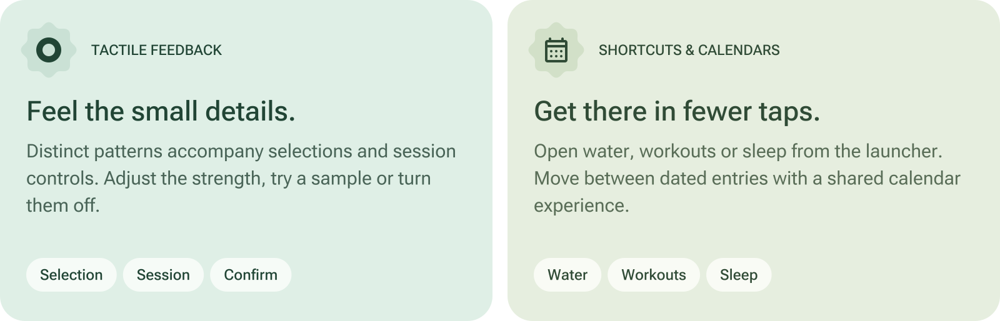
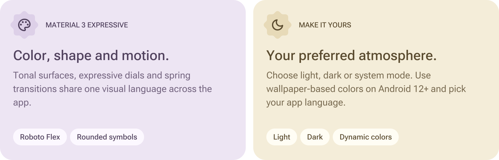
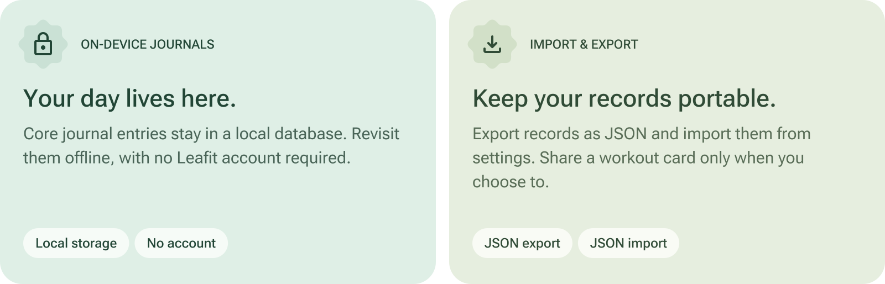

<a name="top"></a>

<p align="center">
  
</p>

<div align="center">

# Your day. Your rhythm.

**A personal Android journal for movement, meals, water, rest and everyday notes.**

Leafit brings the details of your day into one place, with an interface inspired by<br />
**Material 3 Expressive**: soft tonal surfaces, tactile controls and thoughtful motion.

<p align="center">
  &nbsp;&nbsp;
  &nbsp;&nbsp;
  &nbsp;&nbsp;
  &nbsp;&nbsp;
  <a href="https://ko-fi.com/soluv">&nbsp;&nbsp;
  &nbsp;&nbsp;
  </p>

[Explore the screens](#screens) &nbsp; · &nbsp; [Discover the features](#features) &nbsp; · &nbsp; [Design & personalization](#design) &nbsp; · &nbsp; [Data & privacy](#data) &nbsp; · &nbsp; [For developers](#developers)

</div>

<br />

<a name="screens"></a>

## Four spaces. One personal journal.

Open Leafit for a quick overview, a planned session, a meal entry or a note about your sleep. The same calendars, rounded controls and floating navigation connect all four screens, so moving between them feels familiar.

The panels below combine real screenshots from the English light theme with an overview of each screen. Select a panel to open the original screenshot.

<a name="home"></a>

<a href="docs/screenshots/DashboardScreen.png">
  <picture>
    <source media="(max-width: 600px)" srcset="docs/leafit/home-mobile.webp" />
    
  </picture>
</a>

### Home — the day, brought together

The home screen combines a personal greeting with an activity overview, a step summary and quick access to your profile, achievements and settings. Rounded rings and compact summaries give the day a clear visual structure; weekly charts make it easier to return to earlier activity and sleep entries.

The journal also leaves room for context. Add a daily note, look through previous notes or pin an entry you want to find again. A recorded session and a few words about how it went can sit alongside each other, making history more useful when you revisit it later.

**At a glance:** daily activity · steps · weekly charts · personal notes · achievements · profile

<br />

<a name="workouts"></a>

<a href="docs/screenshots/WorkoutsScreen.png">
  <picture>
    <source media="(max-width: 600px)" srcset="docs/leafit/workouts-mobile.webp" />
    
  </picture>
</a>

### Workouts — a session with room for detail

Start with an activity and subtype, then choose how much detail to record. The journal supports running, walking, cycling, strength sessions, yoga, Pilates, swimming and sports, with activity variants and custom setups. Add exercises, change their order and choose between repetition, time, distance or score entries according to the session.

The circular timer gives the session a clear starting point. Pause and resume when needed, record sets and use rest countdowns between them. Save a setup as a template so you can return to the same structure later without entering everything again.

Completed sessions remain available in history with their recorded details and notes. Edit an entry when something needs correcting, and reopen a saved route when GPS was enabled. Outdoor route recording is a choice made before starting a supported activity.

**Session tools:** activity variants · exercises · sets & repetitions · timers · templates · editable history

<br />

<a name="meals"></a>

<a href="docs/screenshots/MealsScreen.png">
  <picture>
    <source media="(max-width: 600px)" srcset="docs/leafit/meals-mobile.webp" />
    
  </picture>
</a>

### Meals & water — everyday entries, kept in order

Breakfast, lunch, dinner and snacks each have a place in the daily journal. Keep entries grouped by occasion, reuse saved meals and manage your own food records. The calendar opens previous days, making it easy to review or correct an earlier entry without losing your place in the rest of the app.

The water card keeps its controls close to the summary. Add a portion with a quick action, undo the most recent entry when needed and configure optional reminders. Meals and water share the same dated structure as the rest of Leafit, so they remain part of one journal rather than a separate collection of records.

**Everyday tools:** meal groups · saved entries · personal food records · water journal · reminders · calendar

<br />

<a name="sleep"></a>

<a href="docs/screenshots/Sleepscreen.png">
  <picture>
    <source media="(max-width: 600px)" srcset="docs/leafit/sleep-mobile.webp" />
    
  </picture>
</a>

### Sleep — time, rest and how the night felt

Use the moon-and-sun dial to set bedtime and wake time, or enter both values manually. Separate lavender and warm controls distinguish the two ends of the night. The duration accounts for midnight, and the dial labels describe hours since bedtime rather than assuming every entry begins at midnight.

A quality rating, tags and a personal note add context beyond the duration. Browse saved entries, edit a previous night and use weekly summaries to revisit the journal over time. The cycle illustration gives the entered interval a visual shape alongside the other sleep details.

> [!NOTE]
> Sleep is entered manually. The cycle chart is an illustration based on the entered duration; Leafit does not measure sleep stages or detect REM, deep sleep or awakenings.

**Rest journal:** interactive dial · manual input · duration · quality ratings · tags & notes · weekly history

<br />

<a name="features"></a>

## More ways to make the journal yours

Leafit's tools extend beyond the four main screens. Configure a workout once, follow its timer outside the app, bring a summary onto your home screen or share a finished session as a card.

<a name="routes"></a>

<picture>
  <source media="(max-width: 600px)" srcset="docs/leafit/gps-journal-mobile.svg" />
  
</picture>

### A route you can return to

Enable **Record route on the map** before a supported outdoor run, walk or cycling session. A full-screen map shows the recorded path, with a position marker, a recenter action and floating controls for the session. Static activities use the workout journal without needing a map.

Track **distance, elapsed time, speed, average pace and fastest/slowest recorded pace**. Pause or resume during the activity; hold the finish control to open completion, helping prevent an accidental tap from ending the session. The route and its recorded metrics can be reopened from history. Saved drafts support recovery after a process interruption and return on pause.

Maps use **MapLibre and OpenStreetMap**, with no map API key required. Map tiles need an internet connection and use caching. The current GPS implementation uses Google Play services.

### A journal that adapts to the activity

Choose an activity variant or create a custom setup with your own title, exercises and rest periods. Repetition entries support sets and optional equipment weight; timed entries capture duration, distance entries suit laps or segments, and score entries support games and practice sessions.

Reorder the exercises to match the session and save the arrangement as a **reusable template**. Keep a note with the result, review completed sets and edit a saved session when necessary. The same history can hold both simple timed activities and more detailed exercise journals.

<br />

<a name="timers"></a>

<picture>
  <source media="(max-width: 600px)" srcset="docs/leafit/timers-widgets-mobile.svg" />
  
</picture>

### Follow the timer outside the app

An ongoing notification reflects the current session state: **workout time, set timer or rest countdown**. Pause, resume or skip a rest period from the notification, then return to the app when you need the full journal or completion controls. Android's native chronometer keeps the displayed timer moving.

A user-started session runs through a foreground service with a visible notification. Pausing also pauses the remaining rest time. If Android stops the process, the saved draft returns on pause rather than silently continuing a session you may no longer be recording. Notification permission enables timer alerts; exact-alarm access helps with rest alerts when the screen is locked, although device power-saving policies can still affect delivery.

### Bring Leafit onto your home screen

Choose the widget that suits what you want nearby:

- **My day** — today's steps and a summary of saved workouts.
- **Sleep** — the date and duration of the latest sleep entry.
- **Workout** — the active session, set or rest timer, with pause/resume controls and GPS session information when applicable.

Add them through **Settings → Touch and quick access**, or use your launcher's widget picker. Rounded tonal surfaces and Material Symbols connect the widgets to the app, while their light and dark colors follow the system theme.

<br />

<a name="sharing"></a>

<picture>
  <source media="(max-width: 600px)" srcset="docs/leafit/share-notes-mobile.svg" />
  
</picture>

### Turn a saved session into a story

Select **Share workout** from a saved entry or route view to create a **1080 × 1920 PNG card**. Choose a light or dark appearance and decide whether to include a map, a route outline or no route. Distance sessions can show distance, duration, average pace and speed; exercise journals show details such as duration, completed sets and exercises.

Preview the complete image before opening Android's share sheet, then send it to Telegram, another messaging app or any compatible destination. Map cards retain OpenStreetMap attribution, and a route outline remains an option when the map cannot load. Nothing is posted automatically.

### Keep the context behind the entries

Daily notes give you a place for the details a timer or chart cannot capture. Write about a session, a change of routine or something you want to remember, then return to it through the notes history.

Search previous notes and pin an entry for easier access. Dated records keep those observations connected to the rest of the journal. Profile customization and local achievement badges add a personal layer without requiring a Leafit account or a public profile.

<br />

<picture>
  <source media="(max-width: 600px)" srcset="docs/leafit/haptics-access-mobile.svg" />
  
</picture>

### Feedback you can feel

Leafit's haptic engine uses distinct short patterns for **selection, pressing, starting, pausing and confirmation**. Adjust the feedback strength, try a sample in settings or switch it off. Supported devices use vibration primitives; other devices use short fallback patterns, with system touch-vibration settings respected.

These small responses accompany the visible state of a control, so an interaction can feel different when a session starts, pauses or finishes. The settings keep the choice with you, including the option to use the app without touch vibration.

### Fewer steps to the screen you need

Long-press the launcher icon to open **water, workouts or sleep** directly. Within Leafit, calendars make it possible to move between dated entries, while the floating navigation keeps the four main screens within reach.

History cards summarize previous entries and expand when you want more detail. Edit supported records from their history rather than recreating them. These shared patterns keep daily entry, review and correction consistent across the journal.

<br />

<a name="design"></a>

## Expressive, down to the details

<picture>
  <source media="(max-width: 600px)" srcset="docs/leafit/design-themes-mobile.svg" />
  
</picture>

### One visual language, throughout the app

Mint and sage establish the main palette, with lavender and warm accents separating different kinds of information. Tonal containers create depth, while rounded timers, rosette shapes and the moon-and-sun dial give the interface its character. **Bundled Roboto Flex** and **Material Symbols Rounded** carry that language across headings, controls and summaries.

Spring transitions connect screens, the active navigation pill expands to reveal its label, and floating headers give content room as you scroll. Collapsible records, calendars and selection controls use related shapes and motion so the interaction patterns stay recognizable.

### Set the atmosphere

Choose **light, dark or system appearance**. On Android 12 and later, optional dynamic colors can draw from your wallpaper. Select **English, Ukrainian or Russian** for the interface, and adjust tactile feedback to suit your preference.

The same attention extends to settings, achievement badges, launcher shortcuts and the version card. Core actions remain identifiable by their icons and labels, while color and shape add emphasis to the current state.

<br />

<a name="data"></a>

## Your journal, on your device

<picture>
  <source media="(max-width: 600px)" srcset="docs/leafit/data-backup-mobile.svg" />
  
</picture>

### Local records, available offline

Leafit stores journal entries in a **local Room database**. Saved workouts, meals, water, sleep and notes remain accessible on the device. The core journals do not require a Leafit account or an application backend, so there is no sign-up step before you begin.

Network access is used for map tiles; the map is not a fully offline feature. Android system backup may also apply according to your device settings. Local storage describes where Leafit keeps its journal, rather than promising that the operating system or map provider never participates in a data flow.

### Take a copy with you

**JSON export and import** are available in settings, giving your records a portable format. Workout-card sharing is a separate, deliberate action: you choose the appearance and route visibility, preview the result and select the receiving app through Android's share sheet.

<details>
<summary><strong>Which permissions support these features?</strong></summary>

- **Precise location** supports optional GPS route recording.
- **Physical activity** supports step counting on devices with the required hardware.
- **Notifications** show active sessions, timers and configured reminders.
- **Exact alarms**, where granted, help with the timing of rest alerts.
- **Vibration** supports enabled tactile feedback and alerts.
- **Internet** loads map tiles.
- **Foreground services** keep user-started tracking and timers active in the background.

Step counting depends on device hardware and permissions. The current GPS implementation requires Google Play services. Sleep is entered manually, and its cycle chart is illustrative.

</details>

<br />

<a name="developers"></a>

## Built with Android in mind

**Kotlin · Jetpack Compose · Material 3 · Room · Coroutines & Flow · MapLibre**

The UI uses Compose with shared expressive components. ViewModels and repositories connect screen state to local records, with StateFlow carrying updates. Dedicated session and tracking components handle exercise journals, timers, GPS points and recoverable drafts.

Foreground services and notifications keep active sessions visible outside the UI. Home screen widgets use Android's widget APIs and native chronometers. Share cards are rendered through Android Canvas and exported through FileProvider and the system share sheet.

### Build your own copy

Use **JDK 17**, **Android SDK 36** and Android Studio compatible with the project's Gradle configuration. Leafit runs on **Android 8.0 / API 26** and later.

```bash
git clone https://github.com/So1uv/Leafit.git
cd Leafit
```

Open the repository root in Android Studio, sync Gradle, install the requested SDK components and run the `app` configuration on your device or emulator. No map API key or Google Cloud project is needed; the current GPS implementation requires Google Play services and location permission.

<details>
<summary><strong>Command-line builds & source layout</strong></summary>

**macOS / Linux**

```bash
chmod +x gradlew
./gradlew assembleDebug
```

**Windows**

```powershell
.\gradlew.bat assembleDebug
```

The debug APK is written to `app/build/outputs/apk/debug/app-debug.apk`.

Within `app/src/main/java/com/example/fitnesstracker/`:

- `ui/components/` — shared controls, dials and charts.
- `ui/screens/` — the main screens, onboarding and settings.
- `ui/theme/` — color, typography and theme preferences.
- `viewmodel/` — screen state and presentation logic.
- `data/` — Room entities, DAOs and repositories.
- `workout/` — activity catalog, exercise journal and session timers.
- `tracking/` — GPS recording, routes, telemetry and maps.
- `widgets/` — Android home screen widgets.
- `sharing/` — workout card rendering and sharing.
- `utils/` — haptics, steps, reminders, language and backup helpers.

</details>

### Help shape what comes next

Bug reports, translations, focused pull requests and feature suggestions are welcome. For a bug, include the device model, Android version, Leafit version and steps to reproduce it. A screenshot or short screen recording is useful when the issue is visual.

For an idea, describe the task you want to make easier. For a code change, explain what changed and how you checked it; include light and dark screenshots when a UI change needs them.

[Report an issue](https://github.com/So1uv/Leafit/issues) &nbsp; · &nbsp; [Browse pull requests](https://github.com/So1uv/Leafit/pulls)

<br />

<div align="center">
  
<br />

<a href="https://github.com/So1uv/Leafit/releases/latest"></a>

<p align="center"><a href="https://github.com/So1uv/Leafit/releases">Release notes</a> &nbsp; · &nbsp; <a href="https://github.com/So1uv/Leafit/issues">Feedback & ideas</a> &nbsp; · &nbsp; <a href="#top">Back to top ↑</a></p>
