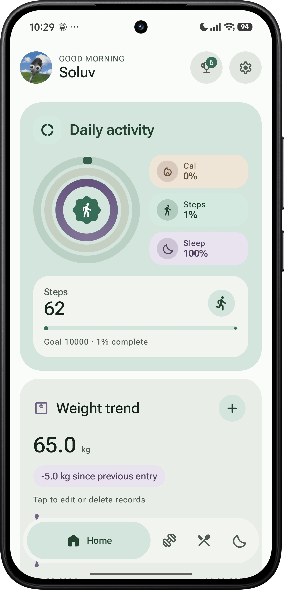
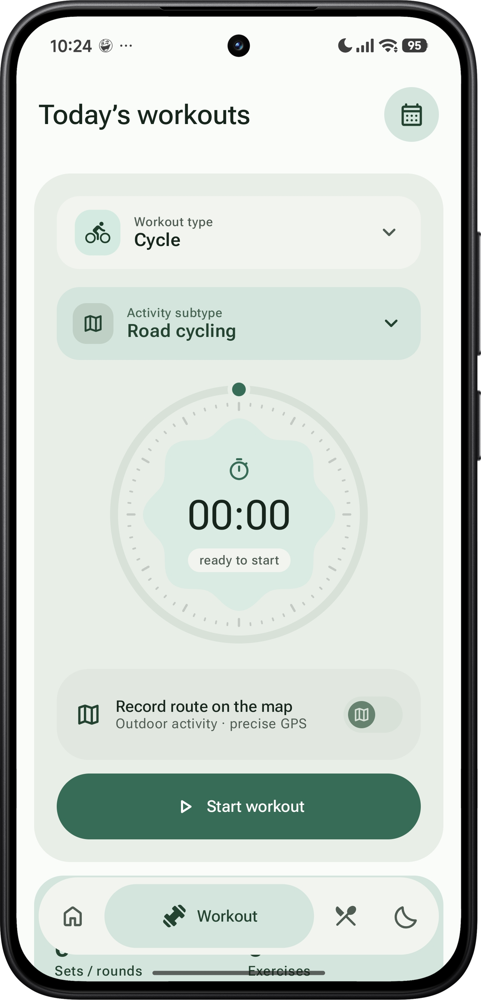
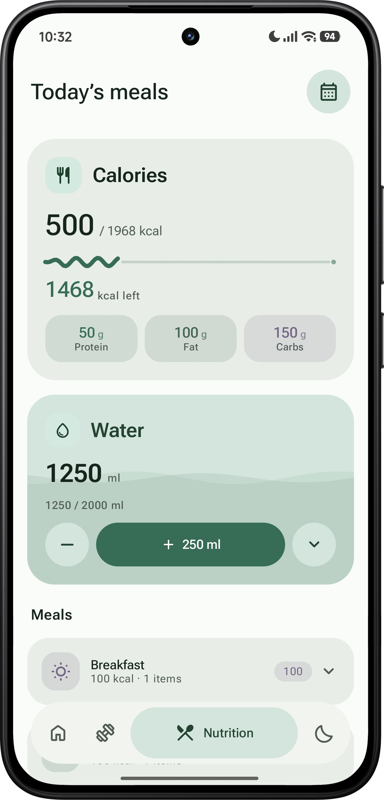
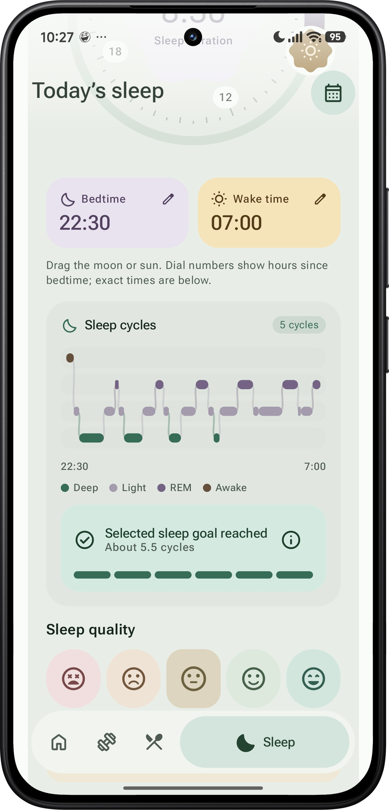

<a name="top"></a>

<div align="center">
  

  <p>
    <a href="https://github.com/So1uv/Leafit/releases"></a>
    
    
  </p>

  <p><strong>Movement, meals, water, sleep and everyday notes — together in a thoughtful Android experience.</strong></p>
  <p>Leafit combines a local daily journal with customizable workouts, optional GPS routes and a soft, expressive interface.</p>

  <p>
    <a href="https://github.com/So1uv/Leafit/releases/latest"></a>
    <a href="https://github.com/So1uv/Leafit/issues"></a>
  </p>

  <p>
    <a href="#at-a-glance">At a glance</a> ·
    <a href="#screens">Screens</a> ·
    <a href="#beyond-the-screens">Features</a> ·
    <a href="#design">Design</a> ·
    <a href="#data-and-privacy">Data</a> ·
    <a href="#build">Build</a>
  </p>
</div>

---

## At a glance

| | Leafit |
| :--- | :--- |
| **Daily journal** | Activity overview, workout history, meals, water, sleep and notes |
| **Workout tools** | Activity variants, custom exercises, sets, rest timers and reusable templates |
| **Outdoor tracking** | Optional GPS recording with OpenStreetMap and MapLibre |
| **Quick access** | Home screen widgets, launcher shortcuts and live timer notifications |
| **Personalization** | Light, dark and system themes; optional dynamic colors; adjustable haptics |
| **Languages** | English · Українська · Русский |
| **Storage** | Local Room database, with JSON import and export |
| **Accounts** | No sign-up or Leafit account required |

<a name="screens"></a>

## Four screens. One daily journal.

The screenshots below show the English interface in the light theme. Select an image to view it at full size.

<table>
  <tr>
    <td width="50%" valign="top">
      <h3 align="center">01 · Home</h3>
      <p align="center"><strong>Your day, brought together.</strong></p>
      <p align="center"><a href="docs/screenshots/DashboardScreen.png"></a></p>
      <p align="left"><strong>On screen:</strong> a personal greeting, the daily activity card, a step counter and quick access to achievements and settings.</p>
      <ul>
        <li>Activity rings and compact summaries organize the day at a glance.</li>
        <li>Weekly charts make saved activity and sleep records easier to revisit.</li>
        <li>Daily notes keep the context behind the numbers.</li>
        <li>Profile, achievements and settings are always close at hand.</li>
      </ul>
    </td>
    <td width="50%" valign="top">
      <h3 align="center">02 · Workouts</h3>
      <p align="center"><strong>A session shaped around your activity.</strong></p>
      <p align="center"><a href="docs/screenshots/WorkoutsScreen.png"></a></p>
      <p align="left"><strong>On screen:</strong> the activity and subtype selectors, a circular session timer, the optional GPS switch and the start action.</p>
      <ul>
        <li>Choose an activity, a subtype or your own session setup.</li>
        <li>Record exercises, sets, repetitions, time, distance or scores.</li>
        <li>Use pause, resume, set timers and rest countdowns.</li>
        <li>Save a session with a note, then revisit or edit it in history.</li>
      </ul>
    </td>
  </tr>
  <tr>
    <td width="50%" valign="top">
      <h3 align="center">03 · Meals &amp; Water</h3>
      <p align="center"><strong>Everyday entries, kept in order.</strong></p>
      <p align="center"><a href="docs/screenshots/MealsScreen.png"></a></p>
      <p align="left"><strong>On screen:</strong> the daily meal summary, the water card with quick portion controls and meals grouped by occasion.</p>
      <ul>
        <li>Keep breakfast, lunch, dinner and snacks in a dated journal.</li>
        <li>Reuse saved meal entries and manage your own food records.</li>
        <li>Add water in one tap or undo the most recent entry.</li>
        <li>Open another day from the calendar and set optional water reminders.</li>
      </ul>
    </td>
    <td width="50%" valign="top">
      <h3 align="center">04 · Sleep</h3>
      <p align="center"><strong>Give your rest a place in the journal.</strong></p>
      <p align="center"><a href="docs/screenshots/Sleepscreen.png"></a></p>
      <p align="left"><strong>On screen:</strong> separate bedtime and wake-time controls, a cycle illustration, a duration summary and expressive sleep-quality choices.</p>
      <ul>
        <li>Set bedtime and wake time with the moon-and-sun dial or manual input.</li>
        <li>See the duration across midnight, with dial labels relative to bedtime.</li>
        <li>Add a quality rating, tags and a personal note.</li>
        <li>Browse weekly summaries and edit previous sleep entries.</li>
      </ul>
    </td>
  </tr>
</table>

> [!NOTE]
> Sleep is recorded manually. The cycle chart is an illustration generated from the entered duration; Leafit does not measure sleep stages or detect REM, deep sleep or awakenings.

<a name="beyond-the-screens"></a>

## More than the main screens

### 🗺️ Take your workout outside

Enable **Record route on the map** before a supported outdoor session. The map becomes the background, with floating controls and a compact panel for your session data.

- **Optional by activity:** route recording is available for supported outdoor running, walking and cycling variants.
- **A live route:** rounded route lines, a position marker and a camera recenter action.
- **Useful telemetry:** distance, elapsed time, speed, average pace and fastest/slowest recorded pace.
- **Session controls:** pause, resume and hold-to-finish, followed by confirmation.
- **Saved routes:** reopen the map and recorded metrics from workout history.
- **Recovery:** restore the saved draft on pause after a process interruption.

**MapLibre + OpenStreetMap — no map API key required.** Map tiles use an internet connection and caching; location acquisition currently uses Google Play services.

### 🧩 Make the workout journal your own

The workout editor supports activities ranging from running and cycling to strength training, yoga, Pilates, swimming and sports. Choose a preset or customize the session title, exercise order and rest periods.

| Entry type | What you can record |
| :--- | :--- |
| **Repetitions** | Sets, repetitions and optional equipment weight |
| **Time** | Timed exercises and recorded durations |
| **Distance** | Distances for individual exercises or laps |
| **Score** | Results for games, rounds and practice sessions |

Save a setup as a **template**, reuse it later and keep notes alongside the completed session.

### ⏱️ Follow the timer outside the app

The ongoing notification follows the current state: **workout time → set timer → rest countdown**. Pause and resume from the notification, skip a rest period, or return to the app to confirm completion.

The workout widget offers quick controls, while the GPS notification keeps elapsed time visible during route recording. Timer displays use Android's native chronometer.

<details>
<summary><strong>Background behavior and rest alerts</strong></summary>

An active session uses a foreground service with an ongoing notification. Pausing also pauses the remaining rest time. If Android stops the process, the saved draft is restored on pause rather than silently continuing the session.

Enable notifications to see timer updates and rest alerts. Exact-alarm access helps deliver rest alerts with the screen locked; Android and device power-saving policies can still affect delivery. Both settings are accessible from Leafit.

</details>

### 🏡 Put Leafit on your home screen

| Widget | What it shows |
| :--- | :--- |
| **My day** | Today's steps and saved workout summary |
| **Sleep** | The duration and date of the latest sleep entry |
| **Workout** | The active workout, set or rest timer; pause/resume controls; GPS session information when applicable |

Add a widget from **Settings → Touch and quick access**, or use your launcher's widget picker. Widgets use rounded tonal surfaces, Material Symbols and light/dark colors that follow the system theme.

Long-press the app icon for quick access to **water, workouts and sleep**.

### 📳 Feel the interaction

Leafit's haptic engine uses distinct short patterns for **selection, pressing, starting, pausing and confirmation**. Adjust feedback strength, try a sample or switch it off in settings.

Supported devices use vibration primitives; other devices use short fallback patterns. System touch-vibration settings are respected.

### 🖼️ Share a session as a story

Select **Share workout** from a saved entry or route view to create a **1080 × 1920 PNG card**.

| Customize | Choose |
| :--- | :--- |
| **Appearance** | Light or dark |
| **Route** | Map, route outline or no route |
| **Distance sessions** | Distance, duration, average pace and speed |
| **Exercise journals** | Duration, completed sets and exercises |
| **Destination** | Telegram, another messaging app or any compatible Android share target |

Preview the complete card before opening the share sheet. Map cards retain OpenStreetMap attribution; the route-outline option is available when the map cannot load.

### 📝 Keep the context, too

Daily notes, a searchable notes history and pinned entries make room for the details that a chart cannot show. Local achievement badges, an editable profile and date-based histories bring the journal together.

<a name="design"></a>

## A softer kind of Android interface

Leafit's interface is built around **Material 3 Expressive-inspired** shapes, motion and color.

<table>
  <tr>
    <td width="50%" valign="top">
      <h3>🎨 Color with a purpose</h3>
      <p>Mint and sage anchor the interface. Lavender and warm accents distinguish related information. Tonal containers establish depth without heavy shadows.</p>
    </td>
    <td width="50%" valign="top">
      <h3>〰️ Motion that connects</h3>
      <p>Spring-based transitions, an expanding active navigation pill, floating headers and collapsible records connect actions to their results.</p>
    </td>
  </tr>
  <tr>
    <td valign="top">
      <h3>✳️ Expressive details</h3>
      <p>Rosette shapes, rounded timers, a moon-and-sun sleep dial, Material Symbols Rounded and bundled Roboto Flex give the screens a shared visual language.</p>
    </td>
    <td valign="top">
      <h3>🌗 Your preferred appearance</h3>
      <p>Choose light, dark or system mode. Enable wallpaper-based dynamic colors on Android 12+ and use the interface in English, Ukrainian or Russian.</p>
    </td>
  </tr>
</table>

<a name="data-and-privacy"></a>

## Your journal lives on your device

Leafit stores journal records in a **local Room database**. The core journals work offline, with no Leafit account or application backend required.

- **Local history:** saved workouts, meals, water, sleep and notes remain available on the device.
- **Portable records:** JSON import and export are available in settings.
- **Intentional sharing:** a workout card is handed to another app only through the share flow you open.
- **Network use:** map tiles are requested from the map provider; maps are not a fully offline feature.
- **Android backup:** system backup may apply according to the device's settings.

<details>
<summary><strong>What permissions are used for?</strong></summary>

| Permission or capability | Purpose |
| :--- | :--- |
| **Precise location** | Record a route when GPS tracking is enabled |
| **Physical activity** | Read step information on supported devices |
| **Notifications** | Show active timers, route recording and configured reminders |
| **Exact alarms** | Improve timing of rest alerts where access is granted |
| **Vibration** | Provide tactile feedback and enabled notification alerts |
| **Internet** | Load map tiles |
| **Foreground services** | Keep user-started tracking and timers active in the background |

Step counting depends on device hardware and permissions. GPS tracking currently requires Google Play services. Sleep entries are manual.

</details>

<a name="build"></a>

## Build it yourself

### Requirements

- **Android Studio** with support for the project's Gradle configuration.
- **JDK 17** and **Android SDK 36**.
- A device or emulator running **Android 8.0 / API 26** or later.
- Google Play services and location access to use the current GPS implementation.

### Open and run

1. Clone the repository:

   ```bash
   git clone https://github.com/So1uv/Leafit.git
   cd Leafit
   ```

2. Open the repository root in Android Studio and let Gradle sync.
3. Install the requested SDK components if prompted.
4. Select the `app` run configuration and your device, then choose **Run**.

No map API key or Google Cloud project is needed.

<details>
<summary><strong>Build an APK from the command line</strong></summary>

**macOS / Linux**

```bash
chmod +x gradlew
./gradlew assembleDebug
```

**Windows**

```powershell
.\gradlew.bat assembleDebug
```

The debug APK is written to:

```text
app/build/outputs/apk/debug/app-debug.apk
```

</details>

### Under the hood

<p>
  
  
  
  
  
</p>

| Layer | Technology |
| :--- | :--- |
| **UI** | Jetpack Compose, Material 3, custom expressive components |
| **State & architecture** | ViewModels, repositories, StateFlow and a shared workout session engine |
| **Persistence** | Room, SharedPreferences and local session drafts |
| **Asynchronous work** | Kotlin coroutines and Flow |
| **Navigation** | Navigation Compose and tab paging |
| **Maps & location** | MapLibre Native, OpenStreetMap, Fused Location Provider |
| **Background work** | Foreground services, AlarmManager and notifications |
| **Widgets** | AppWidgetProvider, RemoteViews and native Chronometer |
| **Image sharing** | Android Canvas, PNG export, FileProvider and the Android share sheet |

<details>
<summary><strong>Explore the source layout</strong></summary>

Paths below are relative to `app/src/main/java/com/example/fitnesstracker/`.

| Directory | Responsibility |
| :--- | :--- |
| `data/` | Entities, DAOs, Room database and repositories |
| `ui/components/` | Shared controls, dials, charts and journal components |
| `ui/screens/` | Home, workouts, meals, sleep, onboarding and settings |
| `ui/theme/` | Color schemes, typography, shapes and theme preferences |
| `viewmodel/` | Screen state and presentation logic |
| `workout/` | Activity catalog, exercise journal, session engine and rest timers |
| `tracking/` | GPS service, route storage, telemetry and map views |
| `widgets/` | Android home screen widgets |
| `sharing/` | Workout card rendering and sharing |
| `utils/` | Haptics, step tracking, reminders, language and backup helpers |

</details>

## Contributing

Ideas, bug reports, translations and focused pull requests are welcome.

- **Report a problem:** include the Android version, device model, app version and steps to reproduce it. Attach a screenshot or screen recording when it helps.
- **Suggest an improvement:** describe the task you want to make easier and where it belongs in the app.
- **Submit a change:** open a branch in your fork, keep the change focused and explain how you checked it. For UI changes, include light and dark screenshots where relevant.

[Open an issue](https://github.com/So1uv/Leafit/issues) · [Browse pull requests](https://github.com/So1uv/Leafit/pulls)

## People behind Leafit

<table>
  <tr>
    <td align="center" width="220">
      <a href="https://github.com/So1uv"><br /><strong>So1uv</strong></a>
      <br />Android development<br />UI &amp; UX design
    </td>
    <td align="center" width="220">
      <a href="https://github.com/CronoxL9S"><br /><strong>CronoxL9S</strong></a>
      <br />Android development<br />Architecture &amp; logic
    </td>
  </tr>
</table>

<details>
<summary><strong>Design inspiration and acknowledgements</strong></summary>

- **Zenith** — a visual reference for expressive Android layouts and motion.
- **Google Material 3** — the foundation for the interface's component and color language.
- **Material Symbols Rounded** and **Roboto Flex** — icons and typography. Their license files are included in `third_party/`.
- **MapLibre** and **OpenStreetMap contributors** — map rendering and map data.

</details>

---

<div align="center">
  <strong>Your day. Your rhythm.</strong>
  <p>Made for Android · Built with Kotlin &amp; Jetpack Compose</p>
  <a href="#top">Back to top ↑</a>
</div>
