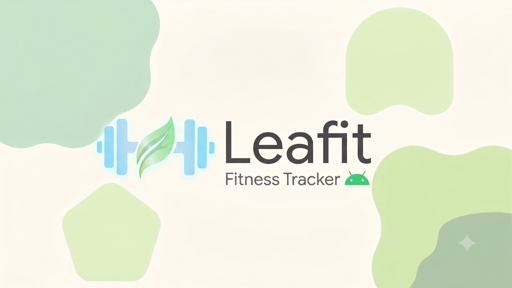
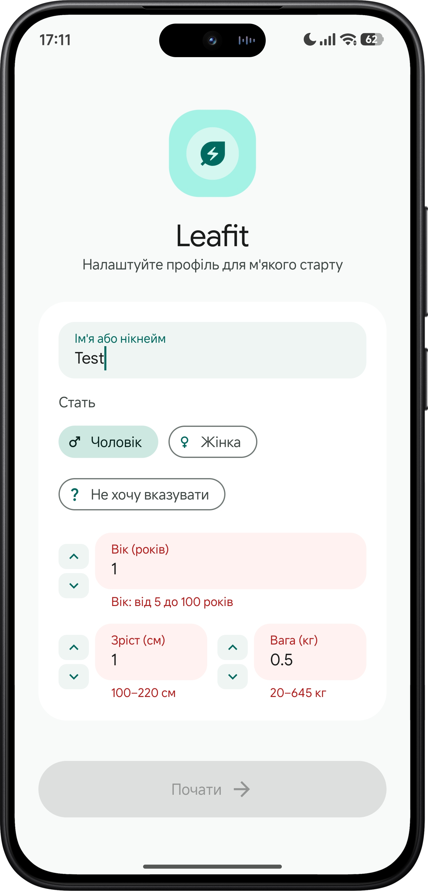
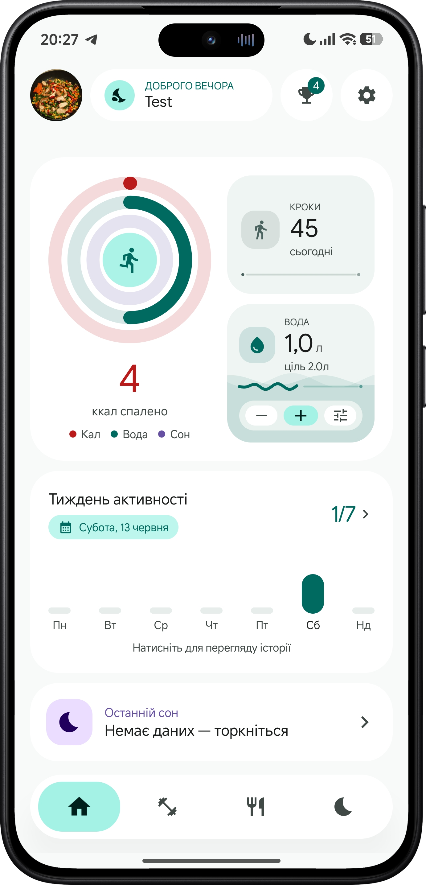
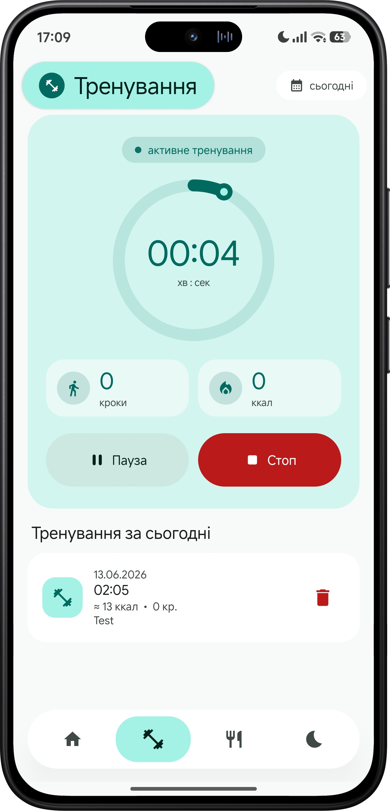
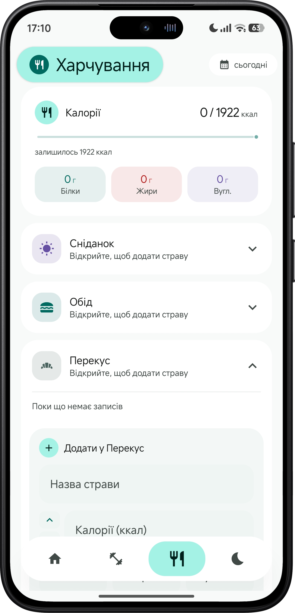
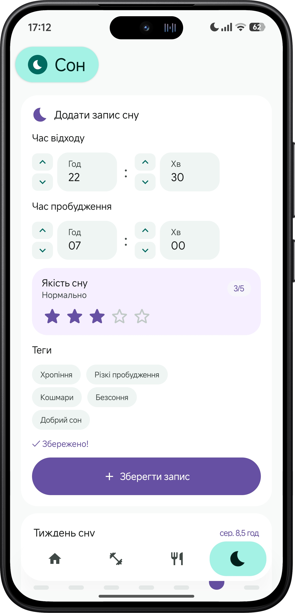
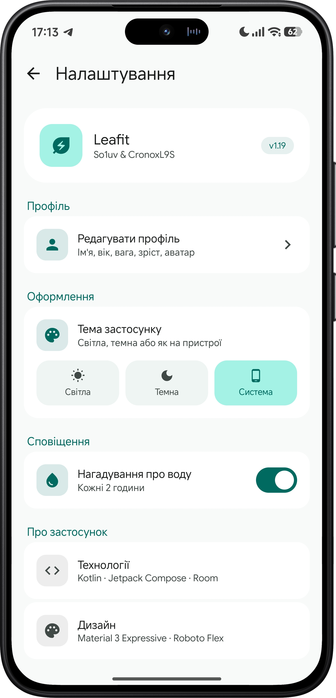
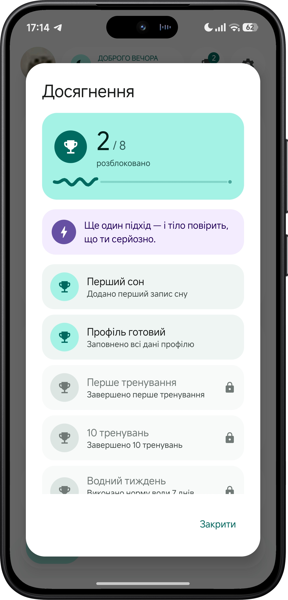
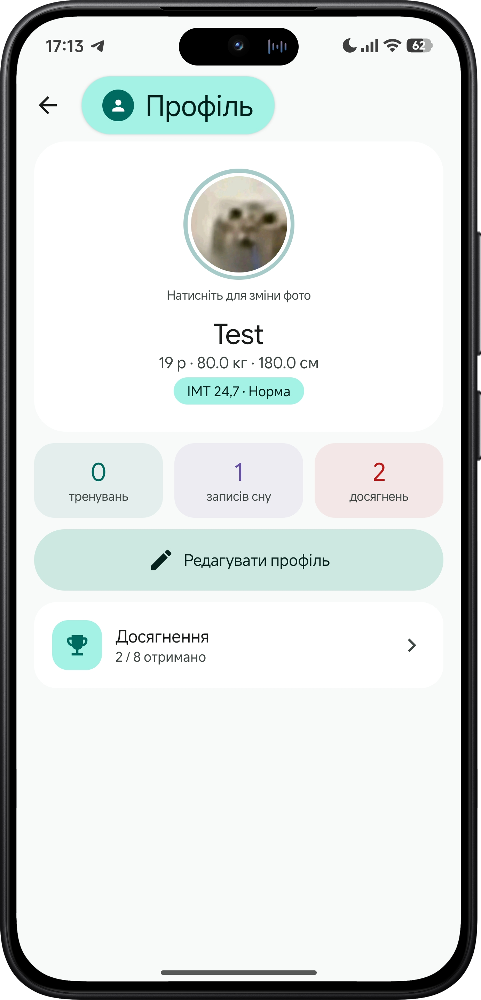

<div align="center">
  
  
  <h3>Здоровый образ жизни. Одно приложение. Ничего лишнего.</h3>

  <p>
    
    
    
    
    
  </p>

  <p>
    <b>Leafit</b> — это минималистичный и полностью локальный трекер активности, питания и сна. Создан для тех, кто хочет следить за своим здоровьем без сложных настроек, обязательных регистраций и постоянного подключения к интернету. Данные хранятся только на вашем устройстве.
  </p>

  <p>
    <a href="#-возможности">Возможности</a> •
    <a href="#-стек-технологий">Стек технологий</a> •
    <a href="#-запуск">Запуск</a> 
    <!-- Раскомментируй, когда добавишь APK в Releases -->
    <!-- • <a href="https://github.com/<USER>/Leafit/releases">⬇️ Скачать APK</a> -->
  </p>
</div>

---

## ✨ Возможности

<br/>

<table>
  <tr>
    <td width="42%" align="center">
      
    </td>
    <td width="58%" valign="center">
      <h3>👤 Онбординг и профиль</h3>
      <p>Старт за тридцать секунд — без email, паролей и социальных входов. Пользователь создаёт <b>один локальный профиль</b> прямо на устройстве.</p>
      <ul>
        <li>Имя, пол, возраст, рост и вес в пошаговом мастере</li>
        <li>Мгновенный расчёт <b>ИМТ</b> и <b>суточной нормы калорий</b></li>
        <li>Мягкая палитра и плавные анимации переходов</li>
        <li>Данные сразу питают расчёты на остальных экранах</li>
      </ul>
    </td>
  </tr>
</table>

<table>
  <tr>
    <td width="58%" valign="center">
      <h3>🏠 Главный экран</h3>
      <p>Центральный хаб, который собирает весь день в одном взгляде. <b>Кольца активности</b> показывают прогресс по калориям, воде и сну за долю секунды.</p>
      <ul>
        <li>Шаги, калории, вода и последний сон — на одном экране</li>
        <li>Виджет воды с добавлением и отменой порции в одно касание</li>
        <li>Недельная активность в виде столбиков по дням</li>
        <li>Открытые достижения прямо на дашборде</li>
      </ul>
    </td>
    <td width="42%" align="center">
      
    </td>
  </tr>
</table>

<table>
  <tr>
    <td width="42%" align="center">
      
    </td>
    <td width="58%" valign="center">
      <h3>🏃 Тренировки</h3>
      <p>Полноценный режим тренировки с управлением в реальном времени. Шаги во время занятия считаются <b>отдельно</b> от дневного счётчика.</p>
      <ul>
        <li>Таймер: старт, пауза, продолжение, завершение</li>
        <li>Живой подсчёт шагов, дистанции и сожжённых калорий</li>
        <li>Заметка к тренировке и сохранение результата</li>
        <li>История за любую дату — без подтверждённых записей нет мусора</li>
      </ul>
    </td>
  </tr>
</table>

<table>
  <tr>
    <td width="58%" valign="center">
      <h3>🍽️ Питание</h3>
      <p>Прозрачный дневник питания, который превращает подсчёт калорий в пару касаний. Никаких онлайн-баз — только то, что ввёл сам.</p>
      <ul>
        <li>Типы приёма пищи: завтрак, обед, ужин, перекус</li>
        <li>Учёт калорий, белков, жиров и углеводов</li>
        <li>Дневной итог в сравнении с персональной нормой</li>
        <li>Мгновенный пересчёт остатка калорий по «принципу светофора»</li>
      </ul>
    </td>
    <td width="42%" align="center">
      
    </td>
  </tr>
</table>

<table>
  <tr>
    <td width="42%" align="center">
      
    </td>
    <td width="58%" valign="center">
      <h3>😴 Сон</h3>
      <p>Ручной журнал отдыха с акцентом на простоту ввода и наглядную аналитику недели.</p>
      <ul>
        <li>Время засыпания и пробуждения</li>
        <li>Оценка качества сна по пятибалльной шкале</li>
        <li>Теги и текстовая заметка к каждой записи</li>
        <li>Недельный график и последний сон на дашборде</li>
      </ul>
    </td>
  </tr>
</table>

<table>
  <tr>
    <td width="58%" valign="center">
      <h3>💧 Вода</h3>
      <p>Самый быстрый модуль в приложении — заточен под ввод «на ходу».</p>
      <ul>
        <li>Добавление стандартной порции в одно касание</li>
        <li>Сумма за день и цель гидратации</li>
        <li>Удаление последней ошибочной записи</li>
        <li><b>Локальные напоминания</b> каждые ~2 часа через AlarmManager</li>
      </ul>
    </td>
    <td width="42%" align="center">
      
    </td>
  </tr>
</table>

<table>
  <tr>
    <td width="42%" align="center">
      
    </td>
    <td width="58%" valign="center">
      <h3>🏆 Достижения</h3>
      <p>Лёгкая игровая механика, которая поддерживает регулярность без давления и рейтингов.</p>
      <ul>
        <li>Набор бейджей: первая тренировка, водная неделя, первый сон и другие</li>
        <li>Разблокировка за реальные действия пользователя</li>
        <li>Карточки меняют вид: активные и приглушённые</li>
        <li>Прогресс виден сразу при открытии приложения</li>
      </ul>
    </td>
  </tr>
</table>

<table>
  <tr>
    <td width="58%" valign="center">
      <h3>🙋 Профиль и настройки</h3>
      <p>Центр персонализации и управления приложением. Изменил параметры — все показатели пересчитались автоматически.</p>
      <ul>
        <li>Редактирование имени, пола, возраста, роста, веса и аватара</li>
        <li>Авторасчёт ИМТ, категории веса и нормы калорий</li>
        <li>Тема: светлая, тёмная или системная</li>
        <li>Переключатель напоминаний и полный сброс данных</li>
      </ul>
    </td>
    <td width="42%" align="center">
      
    </td>
  </tr>
</table>

---

## 🛠 Стек технологий

Приложение разработано с использованием современных подходов Android-разработки:

* **UI:** Jetpack Compose, Material Design 3
* **Архитектура:** MVVM (Model-View-ViewModel), Clean Architecture
* **Навигация:** Jetpack Navigation Compose
* **Локальная БД:** Room Database
* **Асинхронность:** Kotlin Coroutines & Flows
* **Фоновые задачи:** AlarmManager / WorkManager (для напоминаний)

---

## 🚀 Запуск для разработчиков

Проект легко собрать и запустить в любимой IDE (рекомендуется **Android Studio** последних версий).

1. Склонируйте репозиторий:
```bash
   git clone [https://github.com/](https://github.com/)<USER>/Leafit.git
